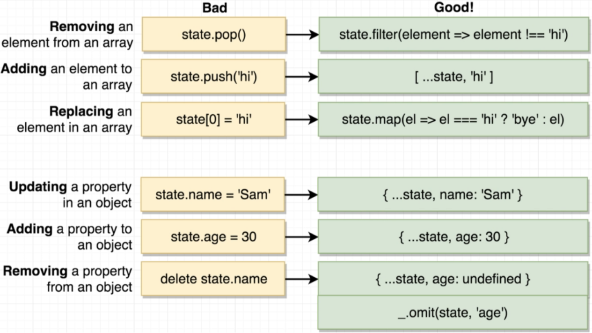
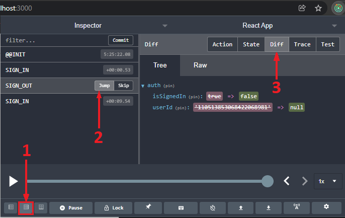

# React.js
## Basics
Working with React means working with two separate libraries:
1) **React** - Has code which knows how to get components to work together (how to call a component function, take the JSX it returns and iterate over all the elements and decide to create an HTML element or call another component function). It's called a *reconciler*.
2) **ReactDOM** - Knows how to take JSX, turns it into HTML, and then puts the HTML into the DOM, which is then displayed in the browser. It's called a *renderer*.

When a link is entered into a web browser, then the browser sends a request to the server hosting the website for an `index.html` file. After `index.html` is received in the response, the browser parses the file, one of the `<script>` tags inside it tells the browser to make another request for a special JS file called `bundle.js`, which combines all the different JS files which make up the web application.

**Babel** is a library used to convert newer versions of JS (ES 2015, 2016 and onward) - which might not be supported by some browsers - into a version of JS which is supported by most browsers (ES5).

Using `import` instead of `require` to load in JS modules only specifies what kind of method is used to share the code between different JS files. ES2015 modules use `import`, whereas CommonJS modules use `require`.

The **React** way of returning multiple items from a function is to return them as an array, whereas the common JS way is to return them inside an object. Either way works.

A VM isn't needed for the deployment of a **React** application because it isn't executing any code on any server, but hosting plain static files (unlike the *Node JS API*, for example). This means it costs dramatically less to deploy a **React** application compared to applications which execute code, and thus need VMs.

To deploy with Vercel, first install the Vercel CLI using `npm install -g vercel`. After that, `cd` into the project directory, then do `vercel login`. Next, type `vercel` into the command line, and just press Enter to accept the default values since they work just fine for `create-react-app` projects. The app will then be deployed online. After making changes to the app, it can be redeployed with the `vercel --prod` command.

To deploy with Netlify, all work is done on their website. You must create a GitHub repo for the project, push the project onto the repo, then link your GitHub profile with Netlify. After that select **New site from Git**, select the repository you want to use, and you're done. The deployment URL is random initially, but can be changed in the settings afterwards. Netlify syncs with the GitHub repository, so the project is automatically deployed again after every push. Vercel can also be set up to track a GitHub repo.

___
## JSX
JSX syntax differs from HTML in a few ways. Properties inside tags are done differently, where JS variables in curly brackets are used in place of multiple entries inside double quotation marks. The first set of curly brackets indicates that a JS variable will be referenced, while the second set (inside the first) denotes a JS *object*. Note that compound attribute names like `'background-color'` are changed to camelcase (`'backgroundColor'`).

```javascript
<div style="border: 1px solid red;"></div>          // HTML
<div style={{ border: '1px solid red' }}></div>     // JSX
<button style="background-color: blue; color: white;">Submit</button>		// HTML
<button style={{ backgroundColor: 'blue', color: 'white' }}>Submit</button>	// JSX
```


The convention is to use double quotes for JSX properties and single quotes everywhere else.

```javascript
<label for="inputEmail">Email: </label>
```


When assigning a class to a tag for styling later on, `className` is used instead of `class`. The same applies to the `for` keyword used in the <label> tag, which is converted to `htmlFor`. Although they often result in code which generally works fine, JS keywords should be avoided and their substitutes should be used instead.

```javascript
<label class="myLabel" for='inputEmail'>Sample text</label>	    // HTML
<label className="myLabel" htmlFor='inputEmail'>Sample text</label> // JSX
```


JSX can show a lot of things like variables and things returned from functions, but it can't show objects where text is expected. However, it **can** show object properties, so `txt.msg` would work just fine whereas `txt` on its own would cause an error.

```javascript
const App = () => {
    return (
    	<button style={{ backgroundColor: 'blue', color:'white' }}>
	    {txt}
    	</button>
    );
}

txt = 12345
txt = 'TestMessage'		// Works
txt = ['Test', 'Message']	// Works
txt = { msg: 'TestMessage' }	// Doesn't work
```


___

## Components
A *React component* is a JS **function** or **class** that *returns some JSX* (which turns into HTML that is shown to the user) and *handles feedback from the user* (using event handlers). **JSX** is basically a set of instructions which tells **React** what to display on the screen. Before JSX is rendered in the browser, it first needs to be converted into regular JS code. Each tag in JSX is examined by checking if it's a *DOM* element (for example, a `<div>`). If so, the element is rendered. If it's a component, then the component function is called and all the JSX it returns is also inspected.

Three tenets of **React**:
1) **Component Nesting** - A component can be shown inside of another component
2) **Component Reusability** - Components should be easily reused throughout the application
3) **Component Configuration** - Components should be such so that we're able to configure them when they're created.

Creating a reusable, configurable component is done in a few steps:
1) Identify the JSX that is duplicated and that could be reused
2) Identify the purpose of that block of JSX and name the new component appropriately (eg. `Comment`)
3) Create a file with the same name as the chosen component name (`Comment.js`)
4) Place the selected JSX into the file and make it configurable by using the **props** system
5) The finished component should then have an `export default COMPONENTNAME`, in this case it would be `export default Comment`, after which it should be imported elsewhere with `import Comment from 'COMPONENT_PATH'` (with the appropriate component path)

The `ReactDOM.render()` function accepts two arguments:
1) The **React** component which is to be rendered (`<App />` in the example above)
2) The location inside the `index.html` file where the HTML from the component we selected will be placed into (`document.getElementById("root")` in the example above)

```javascript
ReactDOM.render(<App />, document.getElementById("root"));
```

___

## Props
When nesting components, the component which holds other components inside it is called the **parent component**, and the components inside it are its **children** (or **child components**). The **props** system (short for **properties**) is then used to pass data from a parent component to a child component, where the goal is to customize or configure the child component. It's all about having a parent customize how a child looks or behaves.

Information is passed from a parent to a child through props in a similar way to how HTML elements are given attributes. Default values for props can be set by using the OR operator after a prop, followed by the default value (like `<div>{props.text || 'Text placeholder'}</div>`).

```javascript
// Inside parent component
<Comment
    author="Mike" 
    text="Thanks for the info!" 
    postedAt={commentInfo.date} 
/>

// Definition of child component inside child component file
const Comment = props => {
    // Some code...
    <a href="/">{props.author}</a>
    <div>{props.text || 'Text placeholder'}</div>   // Default prop example
    // Some code...
}
```


A better way to set default values for props is to create a special object, which is created as an attribute of our component called `defaultProps` (for example `ExampleComponent.defaultProps`).

```javascript
Comment.defaultProps = {
    author: 'Mike Mikerson',
    text: 'Text placeholder'
}
```


If a component is passed as a prop, it's referenced by using `{props.children}`.

```javascript
// Inside parent component
<CommentSection
    <Comment
        author="Mike" 
        text="Thanks for the info!" 
        postedAt={commentInfo.date} 
    />
/>

// Inside child component
const CommentSection = props => {
    // Some code...
    <div>{props.children}</div>   // This is where the child component will be inserted
    // Some code...
}
```


___

## Class Components
Props inside **class components** are used as part of `this`, so `this.props` instead of just `props`.

With the help of the **hooks system**, **function components** can have the same functionality as the **class components**, using hooks in place of the **Lifecycle Method system** to run code at specific points in time and using hooks to access the **state system** and update content on the screen. Functional components are good for simple content, while class components are good for just about everything else.

Some of the benefits of class components are:
1) Easier code organization
2) Usage of the **state** system, which makes it easier to handle user input
3) Usage of the **Lifecycle method** system, which enables rerendering when conditions are fulfilled

Class components follow three rules:
1) They must be a JS class
2) They must define a `render` method that returns some JSX
3) They must extend (subclass) `React.Component` (borrow useful methods other than `render`)

The **state** system is used to manage data inside of the application, data which is prone to change over time. In general, the **state** system is used when we want **React** to update the content on the screen (for example when text is typed in or when a different option is selected). `state` is a JS object that contains data relevant to a component. Updating it causes the component to rerender. It **must** be initialized when a component is created and it should **only** be updated using the function `setState`.

```javascript
this.state = { text: "Example text" }

// Don't do this, it's not how 'state' variables should be modified
this.state.text = "Something"

// Do this instead, it rerenders the page as intended by 'state'
this.setState({ text: "Something" })
```


The `constructor` method is automatically called whenever a class component is first created, before anything else, and thus a good way to initialize **state** is by doing it inside of the `constructor`. Because writing the `constructor` overloads the one implemented in `React.Component`, a line with `super(props)` must be present in the constructor in order to call the original constructor from `React.Component`, so that it can set the component up for us. If only **state** is initialized in the constructor, the entire constructor should be deleted and replaced with a `state = { exampleMsg: "This is an example!" }` (note that it says `state`, not `this.state` when initialized this way).

```javascript
class Example extends React.Component {
    // One way of initializing state, through a constructor
    constructor {
        super(props);
        this.state = { exampleMsg: "This is an example!" };
    }
    
    // A simpler alternative that can be done instead of the constructor
    state = { exampleMsg: "This is an example!" }
}
```


Variables in `state` which we know are going to be arrays or objects should be initialized as empty arrays or objects, so that we don't get error messages when we call methods specific to those data types (such as `length`).

A **component lifecycle method** is a function that can optionally be defined inside of class-based components. If they're implemented, they'll be called automatically during certain points of a component's lifecycle. Some of these (in order of when they're triggered) are:
1) `constructor` - Always called first. Good place to do one-time setup. Shouldn't be used for data-loading according to the best practices, in order to have clean code.
2) `render` - Called after the constructor, unique in that it's not optional. Should avoid doing anything besides returning JSX here (such as making network requests).
3) `componentDidMount` - Called immediately after the component first gets rendered on the screen. Good place to do initial data-loading for the component, or start an outside process (like getting the user's geolocation).
4) `componentDidUpdate` - Called when a component updates itself, like through `setState`. `render` gets called before it every time. Good place to do more data-loading when there's a change to the **state** or **props**.
5) `componentWillUnmount` - Called when the component stops being displayed on the screen, useful for cleanup (especially for non-React stuff).

Three more lifecycle methods exist (`shouldComponentUpdate`, `getDerivedStateFromProps` and `getSnapshotBeforeUpdate`), but they're very rarely used.

___

When methods are passed to JSX element properties, parentheses aren't added at the end of the method, otherwise the method is called whenever the component is rendered. By leaving off the parentheses, the reference to the method is passed instead, so that it can be called at the appropriate time. These callback methods should follow a naming convention starting with `on` (or `handle`), followed by the name of the element it's assigned to (`input` in the above example), followed by when it's called (on the element being changed in the above example - `change`), for example `onInputChange` for something that triggers when a text input is changed. This is done so that the callback function names clearly convey their purpose. An alternative to single-line callback functions is to write them inline as an arrow function (like in the example above).

When the callback method is invoked, one argument will be passed to it automatically. This argument object is usually referred to as the `event` object, and it's a JS object which contains information about the event which just occurred. It can be accessed by using `event.target.value` to get the text from an input field, for example. Here are some special property names used to wire up callback methods and event handlers:
1) `onClick` - Triggers when the user clicks on something, supported by just about any JSX element
2) `onChange` - Triggers when the user changes text in an input
3) `onSubmit` - Triggers when the user submits a form

```javascript
onInputChange(event) {
    this.setState({ msg: event.target.value });
}

render() {
    return (
        <form className="ui form">
            <div className="field">
                <label>Search</label>
                //                           No parentheses    v
                <input type="text" onChange={this.onInputChange} />
                
                //          Alternate inline way without callback method
                //                            \/   Event object
                <input type="text" onChange={(e) => this.setState({ 
                    msg: e.target.value
                })} />
            </div>
        </form>
    );
}
```


Another thing to note is that it's better to use **controlled components** than **uncontrolled components**. This is because controlled components always contain the values they're working with in **React**, and they don't have to look inside the HTML DOM to find them. All the data we're working with should be centralized inside **React** components. Another useful thing this allows us to do is setting the default values of elements (such as through **state**).

Callbacks can be used to transfer data from a child component to a parent component. This can be done by passing a method from a parent component to a child component, who then calls it on certain events.

```javascript
// Uncontrolled component
<input 
    type="text"
    onChange={
        (e) => this.setState({ msg: e.target.value }) 
    } 
/>

// Controlled component
<input 
    type="text"
    // The React controls and stores the data, not the DOM
    value={this.state.msg}
    onChange={
        (e) => this.setState({ msg: e.target.value }) 
    } 
/>
```


___
### Asynchronous requests
Requests can be made using the `axios` library, with the `axios.get` function for **GET** requests. The function returns a `Promise` object, which has a function called `then` we can use to run some code after the response is received.

```javascript
// The '.then' way
onSearchSubmit(searchTerm) {
    axios.get('https://api.unsplash.com/search/photos', {
        params: { query: searchTerm },
        headers: {
            Authorization: API_KEY
        }
    }).then((res) => {
        console.log(res.data.results)
    });
}
```


Another way to do this is by marking the request function as asynchronous, using the `async` keyword in front of the function name, then creating a variable which will hold the response, and assigning the `await axios.get()` statement to it.

```javascript
// The 'await' way
async onSearchSubmit(searchTerm) {
    const res = await axios.get('https://api.unsplash.com/search/photos', {
        params: { query: searchTerm },
        headers: {
            Authorization: API_KEY
        }
    });
    
    console.log(res.data.results)
    }
```


Arrow functions which are also `async` need to have the `async` keyword after the `=` sign, and before the parentheses which hold the parameters. <br>
For example `async myFun (params) {` becomes `const myFun = async (params) => {`.

___

## Hooks
In **React**, the **Hooks system** is all about giving functional elements a lot of additional functionality. Hooks are all about providing tools to write reusable code, instead of more classic techniques like *inheritance*. The **hooks system** provides some inbuilt functions, such as:
1) `useState` - Allows the use of `state` in a functional component
2) `useEffect` - Allows the use of something similar to lifecycle methods
3) `useRef` - Allows the creation of a `ref` in a function component
4) `useContext` - 
5) `useReducer` - 
6) `useCallback` - 
7) `useMemo` - 
8) `useImperativeHandle` - 
9) `useLayoutEffect` - 
10) `useDebugValue` - 
These inbuilt hooks can also be used to write custom hooks - pieces of code which do one very repeatable task.

`state` inside functional elements can be set up by using the `useState` hook. As can be seen from the example, each `state` variable in functional components created using `useState` needs to be declared (using its own `useState`) or changed (using its own setter function) seperately, unlike class components where we can initialize or change multiple `state` variables in a single line (or with a single `this.setState` call).

```javascript
// State variable |                     Default value  |
//               \/                                   \/
const[exampleVariable, setExampleVariable] = useState(null);
//                                    /\
// Function to change this variable   |

// This the class component equivalent
state = { exampleVariable: null };
setExampleVariable = (value) => { this.setState({ exampleVariable: value })
```


`useEffect` allows function components to use something similar to lifecycle methods. The first argument passed to it is the function which needs to be triggered. The second argument is the **dependency array**, which defines in which of the three scenarios will the function be called:
1) When the component is rendered for the first time
2) When it first renders and whenever it rerenders
3) When it first renders and (whenever it rerenders AND some piece of data changes)

```javascript
// Second argument is an empty array
// Trigger on first render
useEffect(() => {
    console.log('Event trigger!');
}, []);

// No second argument
// Trigger on first render and every rerender
useEffect(() => {
    console.log('Event trigger!');
});

// Second argument is an array with a variable
// Trigger on first render
// Trigger on every rerender IF data has changed since last render
useEffect(() => {
    console.log('Event trigger!');
}, [someVariable]);
```


**React** will show a warning whenever a prop or state variable that isn't referenced in the `useEffect` dependency array is referenced inside `useEffect`.

```javascript
// Doesn't work, gives an error
useEffect(async () => {
    await axios.get(SOMETHING);
});

// 1) Make a helper function, then call it
useEffect(() => {
    const search = async () => {
        await axios.get(SOMETHING);
    };
    
    search();
});

// Compact way of the example above
// 2) Define a function and immediately invoke it
useEffect(() => {
    (async () => {
        await axios.get(SOMETHING);
    })();
});

// 3) Make use of Promises
useEffect(async () => {
    axios.get(SOMETHING)
        .then((res) => {
            console.log(res.data);
        });
});
```


**Functions passed to `useEffect` can't be `async`.** There are three solutions to this:
1) Creating a helper function inside of `useEffect` which is `async`, then call it inside `useEffect`
2) Define a function without a name inside of `useEffect` and immediately invoke it
3) Using promises with `axios.get().then()`

```javascript
useEffect(() => {
    console.log("Main Call!");
    
    return () => console.log ("Cleanup Call!");
});

// The console logs will trigger as follows
// First render -----  Main Call!
// Second render ----- Cleanup Call!
// Second render ----- Main Call!
```


When `useEffect` is created and a function is passed as the first argument, the only thing we're allowed to return from it is another function (called the **cleanup function**). The returned cleanup function is then called BEFORE the main function passed to `useEffect` every time after the first render. The cleanup function will also be invoked once the component stops being shown, which can be useful in cases where we want to do cleanup for the entire component.

```javascript
useEffect(() => {
    // onBodyClick contains a ref 'myRef' to a component element
    // myRef will become undefined when the component isn't rendered
    const onBodyClick = (event) => {
        if (myRef.current.contains(event.target)) return;
        setOpen(false);
    }

    document.body.addEventListener("click", onBodyClick, { capture: true } );
    
    // Remove the 'onBodyClick' event listener from the 'click' event
    // This stops the undefined myRef from crashing the app when component is unloaded
    return () => {
        document.body.removeEventListener('click', onBodyClick);
    };
}, []);
```


___

Events in **React** **bubble up**, which is to say that they will propagate from the component where they're created through its parent components, and eventually into the HTML body. Manual event listeners can thus be set up to watch for events which bubble up. However, all event listeners created using `addEventListener` get called first, and the **React** event listeners get called AFTER them. The order inside those two categories is still from the most child element towards the most parent element. It's possible to cancel event bubbling, but it's considered bad practice as it can break other parts of the code.
  
Manual event listeners added with `addEventListener` are usually only called one time, so an empty array is usually passed as the second argument to the `useEffect` function. The callback is also usually defined as a separate helper function inside `useEffect`, so that it can easily be cleaned up with the `removeEventListener`.

```javascript
    // Example component
    const App = () => {
        return ( // 'App' sees it as the parent component
            <div> // I see it as the parent element
                <ExampleComponent> // I see it as the parent component
                    <ExampleElement /> // I create the event
                </ExampleDisplay>
            </div>
        );
    }
    
    // Event listener which will pick up everything
    // (every event will bubble up to the HTML body)
    document.body.addEventListener('click', () => console.log('Click!'));
```


Custom hooks are the best way to create reusable code in a **React** project (besides components). They're created by extracting hook-related code out of a function component, and they always make use of at least one primitive (inbuilt) hook internally. Each custom hook should have **one** purpose, and they're great for tasks like data-fetching. The process of creating reusable hooks is hard to define, but could go something like this:
1) Identify each line of code in a component related to a single purpose
2) Identify the inputs to that code
3) Identify the outputs of that code
4) Extract the code into a separate function, receiving the inputs as arguments and returning the outputs

### Refs
**React** Refs are a system which gives us direct access to a single DOM element that is rendered by a component, and they're used in place of the standard JS `document.querySelector(some_tag)`. Since all JSX elements - even the ones which look like standard HTML elements such as `` - aren't HTML, but are eventually converted to real HTML, we thus have no way to reference them aside from using refs. They're created in the constructor, assigned to instance variables, then passed to a particular JSX element as props. They can be assigned to the `state` of a component, but since refs don't change over time, it shouldn't be done.

```javascript
constructor(props) {
    super(props);
    // Crete ref and assign it to a component instance variable
    this.imageRef = React.createRef();
}

componentDidMount() {
    // Use the ref
    console.log(this.imageRef);
}

render() {
    return(
        // Pass the ref to JSX element as a prop
        
    );
}
```


However, refs on things which are loaded from elsewhere (such as the images in the previous example) won't work properly, since they'll be called on objects whose content arrives after a certain delay. A way to properly use these refs is by adding an event listener which waits for them to load properly.

```javascript
// Won't work, image isn't loaded from the remote source yet
componentDidMount() {
    console.log(this.imageRef.current.clientHeight);
}

// Works - It waits for the image to load before calling the function
componentDidMount() {
    this.imageRef.current.addEventListener('load', this.setSpans);
}

setSpans = () => {
    const spans = Math.ceil(this.imageRef.current.clientHeight / 10);
    this.setState({ spans });
}
```


Refs can be created with hooks using the `useRef` hook function. The `.contains` method is shared for all DOM elements, and allows us to see if an element is contained within another.

```javascript
const exampleRef = useRef();

useEffect(() => {
    document.body.addEventListener("click", (event) => {
        // Stop if event originated from this component
        // event.target returns the element from which the event originates
        if (exampleRef.current.contains(event.target)) return;
        // Some code if the element isn't contained in the ref element
    }, { capture: true } );
}, []);

return (
    <div ref={exampleRef} className="ui form">
        <div className="field">
            // More elements
        </div>
    </div>
);
```


___

## Tips
If a component has conditional statements (using the ternary operator) which are repeated multiple times, it's good to replace them with a configuration structure. The example above shows how, by using the structure, it was possible to avoid multiple ternary statements which had the same condition but returned different things.

```javascript 
const seasonConfig = {
    summer: {
        text: 'Blazing hot!',
        iconName: 'sun'
    },
    winter: {
        text: 'Frosty!',
        iconName: 'snowflake'
    }
};

const getSeason = (lat, month) => {
    if (month>2 && month<9){
        return lat > 0 ? 'summer' : 'winter';
    } else {
        return lat > 0 ? 'winter' : 'summer';
    }
}

const SeasonDisplay = props => {
    const season = getSeason(props.lat, new Date().getMonth());
    
    // Single-line solution made possible by the configuration structure
    const { text, iconName } = seasonConfig[season];
    
    // Bad approach with multiple ternary statements
    const text = season === 'winter' ? 'Frosty!' : 'Blazing hot!'
    const iconName = season === 'winter' ? 'snowflake' : 'sun'

    return (
        <div>
            <i className={`${iconName} icon`} />    // Variable interpolation
            <h1>{text}</h1>
        </div>
    );
}
```


Conditional statements in the `render` method should be avoided because they make it harder to add or change JSX elements. A better way to go about that is by creating a helper method which houses the conditional statements, then calling it inside the `render` method, thus allowing the returned content from that helper method to be easily interacted with by new elements.

```javascript
renderContent() {
    // Would need to add 3 <div> elements here to cover all the cases
    if (...) {  // Condition 1
        // Return 1
    }
    
    if (...) {  // Condition 2
        // Return 2
    }
    
    // Return 3
}

render() {
    return (
        // Only need to add one <div> here to cover all the cases
        <div className="border red">
            {this.renderContent()}
        </div>
    );
}
```


___

### Prevent refresh on form submit
Forms refresh the page by default when they're submitted. This can be prevented by using `event.preventDefault()`.

```javascript
onFormSubmit(event) {
    // Prevent default form behavior, which refreshes the page
    event.preventDefault();
}

render() {
    <form onSubmit={this.onFormSubmit}>
        // Some code...
    </form>
}
```


___

### The `this` keyword
`this` in JS references a concrete instance of a class it's called from. When the callback in the above example is made, the `this` inside of the callback function becomes `undefined`, because the callback function implementation is taken from the instance and used on its own, thus losing the link needed to use `this`. One of the ways to fix this problem is by binding the callback function, then overwriting the current version of the function with the one that always has `this` bound to it. Another way to fix the problem is by turning the function into an arrow function, because arrow functions automatically bind the value of `this` for all the code inside the function. This makes it a good idea to always write callback functions as arrow functions, just to be safe.

```javascript
exampleMethod(event) {
    // This causes an error if one of the fixes isn't applied!
    console.log(this.state);
}

// Fix #1: Bind 'this' to the function
constructor() {
    this.exampleMethod = this.exampleMethod.bind(this);
}

// Fix #2: Convert the function into an arrow function
exampleMethod = (event) => {
    // This causes an error if one of the fixes isn't applied!
    console.log(this.state);
}

render() {
    <form onSubmit={this.exampleMethod}>
        // Some code...
    </form>
    
    // Fix #3: Wrap the function call with an arrow function
    // The function is invoked, not referenced
    // Note the presence of the parentheses v
    <form onSubmit={() => this.exampleMethod()}>
        // Some code...
    </form>
}
```


___

### Map
The `.map` method works on arrays and is passed a function which is applied to each element of an array, then used to generate a new array without mutating the original. The first argument that `map` returns is the currently selected element from the collection, while the second (optional) argument is the index of the element.

```javascript
// Let's say we want to take the 'numbers' array, multiplied by 10
// We also want that to be a new array, without changing the original
const numbers = [0, 1, 2, 3, 4]

// numbers.map(function(num) {}) also works
numbers.map((num) => {
    return num * 10;
});

// Compact version, looks even nicer!
numbers.map(num => num * 10);

// Using index as the second argument
numbers.map((num, index) => {
    return num * 10 * index;
});
```


If rendering items **from a list** (such as when using `map`), each element should have a `key` prop in order to allow **React** to see which elements are already in the DOM, so that they don't have to be rerendered if we're only putting in additional elements. Note that the `key` property should be given to the root tag that's being returned. A `key` should be a value which is consistent and unchanging between rerenders (such as the `id` property often coupled with data).

```javascript
    // Works but gives off a warning that the 'key' prop is missing
    const images = props.images.map((image) => {
        return 
    });
    
    // No warning, has the 'key' prop
    const images = props.images.map((image) => {
        return 
    });
    
    // Destructured and easy on the eyes, doesn't repeat 'image.' several times
    const images = props.images.map(({ id, urls }) => {
        return 
    });
```


___

### `React.Fragment` as a placeholder enveloping element 
Sometimes we want to render multiple things which are already enveloped by a `<div>` inside the parent component, and we might not want to have the extra `<div>` enveloping the elements rendered inside the child element as well (like when borders are applied to `<div>` elements, to avoid double borders being drawn).

`React.Fragment` can be used in place of a `<div>` in this scenario. Note that the `key` special prop can also be applied to these placeholders, in order to avoid warnings related to missing keys later on.

```javascript
<React.Fragment key={someKey}>
    // Other JSX elements
</React.Fragment>
```


___

### Timers with `setTimeout`
The `setTimeout` function accepts two arguments. The first argument is the function which is called once the timer expires, and the second argument is the duration of time. `setTimeout` also returns an identifier, which can be used by the `clearTimeout` function to prevent the timeout function from activating.

```javascript
// Print "Hello!" after 10 seconds
setTimeout(() => console.log("Hello!"), 10000)
```


___

### Array shortcuts [ES2015]
The ES2015 syntax for taking all elements from an array is to use `...` before the array name.
`[...oldArray, newElement]` would return a new array containing all the elements from `oldArray`, as well as the new element `newElement`.

Elements can be filtered out of an array by using the `array.filter(filterFunction)` method. It takes a function which returns `true` if an element should be kept in the resulting array, or `false` if it should be discarded. The original array isn't modified, but a new one is returned instead.

```javascript
// Remove a name from an array and return the new array
const removeName = (someArray, someName) => {
    return someArray.filter(name => name !== someName);
}
```


___

### The `Lodash` library
The `Lodash` library has many useful features, one of which is **memoizing** functions. Memoized versions of functions behave the exact same way as the originals, except that they only return one value per unique argument - repeated calls with the same argument don't invoke the function, but instead only return the result of the first call with that same argument. We can use this when working with functions which do API calls to only make one API request per ID, for instance (like when we're getting user data for a comment chain, where one user will probably have left many comments). `Lodash` is usually imported to an underscore variable (`_`).

```javascript
import _ from 'lodash';

function exampleRequest(id) {
    fetch(id);
}

const memoizedExampleRequest = _.memoize(exampleRequest);

// All function calls will make a request - 5 calls
exampleRequest(1);  // Call
exampleRequest(1);  // Call
exampleRequest(2);  // Call
exampleRequest(2);  // Call
exampleRequest(3);  // Call

// Only one function call will be made per unique argument - 3 calls
memoizedExampleRequest(1);  // Call
memoizedExampleRequest(1);
memoizedExampleRequest(2);  // Call
memoizedExampleRequest(2);
memoizedExampleRequest(3);  // Call
```


Another useful feature that `lodash` offers is the `chain` function, which lets us execute multiple functions with a given parameter one after another.

```javascript
export const fetchPostsAndUsers = () => async (dispatch, getState) => {
    await dispatch(fetchPosts());
    
    // These two lines are one way of doing it (without 'chain')
    const userIds = _.uniq(_.map(getState().posts, 'userId'));
    userIds.forEach(id => dispatch(fetchUser(id)));
    
    // This is how to do it with 'chain'
    _.chain(getState().posts)
        .map('userId')
        .uniq()
        .forEach(id => dispatch(fetchUser(id)))
        .value();  // <-- This executes the chained statements
}
```


___
### Google OAuth
**Google OAuth** can be used to easily authenticate a user. To use **Google OAuth**, you must first add it as a script in the `index.html` file's `<header>`, similar to how the **Semantic-UI** is added.

```javascript
<script src="https://apis.google.com/js/api.js"></script>
```


The **OAuth** is then available for the application after making a new application on your Google Developer dashboard (available at [console.cloud.google.com](https://console.cloud.google.com/)) and setting up the *OAuth Consent Screen* and *Credentials*. You need to define the application URL (http://localhost:3000 for testing), the gmails of the users who will be able to test the app, as well as the scope of the user's information that your app will be getting (the email address alone is enough for just authentication, while the Google userId that's also provided helps with having unique IDs for users).

```javascript
import React from 'react';

class GoogleAuth extends React.Component {
    state = { isSignedIn: null };

    componentDidMount() {
        window.gapi.load('client:auth2', () => {
            window.gapi.client.init({
            // You get this from 'console.cloud.google.com/apis/credentials'
            // OAuth 2.0 Client IDs, configure the OAuth Consent Screen first
                clientId: 'YOUR_ID.apps.googleusercontent.com',
                scope: 'email'
            }).then(() => {
                this.auth = window.gapi.auth2.getAuthInstance();
                this.setState({ isSignedIn: this.auth.isSignedIn.get() });
                this.auth.isSignedIn.listen(this.onAuthChange);
            });
        });
    }

    onAuthChange = () => {
        this.setState({ isSignedIn: this.auth.isSignedIn.get() });
    }

    onSignInClick = () => { this.auth.signIn() }
    onSignOutClick = () => { this.auth.signOut() }

    renderAuthButton() {
        if (this.state.isSignedIn === null) {
            return null;
        } else if (this.state.isSignedIn) {
            return (
                <button className="ui red google button" onClick={this.onSignOutClick}>
                    <i className="google icon" />
                    Sign Out
                </button>
            );
        } else {
            return (
                <button className="ui red google button" onClick={this.onSignInClick}>
                    <i className="google icon" />
                    Sign In with Google
                </button>
            );
        }
    }

    render() {
        return (
            <div>
                {this.renderAuthButton()}
            </div>
        );
    }
}

export default GoogleAuth;
```


___
### Object key interpolation syntax
If we have dynamic object keys (for example the element IDs), we can access them using the key interpolation syntax, which is similar to how arrays are indexed - using the brackets `[ ]`.

```javascript
// This is one approach to create a new object with one edited key - 3 lines
const newState = { ...state };
// Accessing a property using key interpolation
newState[action.payload.id] = action.payload;
return newState

// ES2015 - One line that does the same thing as the 3 above
return { ...state, [action.payload.id]: action.payload };
```


With **ES2015**, we can also access the property and create a new object in the same line, which is particularly useful when writing **Redux** reducers with multiple cases (also covered in this document).


___
### REST PUT behavior
REST conventions are a standardized system for designing APIs. REST methods are:
* `GET` - Returns some data from the server, used to load information
* `POST` - Sends some data to the server, used to store information
* `PUT` - Updates **ALL** properties of a record - if an existing property isn't received in the update, it's deleted (for some APIs, for others it's not, varies on a case-by-case basis)
* `PATCH` - Updates **SOME** properties of a record - only those we send in the request
* `DELETE` - Deletes a record from the server

One should take care to check how the API they're sending `PUT` requests to behaves. Some perform like `PATCH` and replace only the properties that were sent, others remove all properties missing from the request altogether.


___

## Redux
**Redux** is a `state` management library. With **Redux**, rather than maintaining state inside a component, it's extracted into the Redux library. It makes creating complex applications easier, and it's not explicitly designed to work with **React**, and is thus used in other libraries, and there are ports of it for other languages as well. 

The **Redux cycle** consists of the following steps, listed in the order in which they are used: `Action Creator`->`Action`->`Dispatch`->`Reducers`->`State`.
* An `Action Creator` is a function that creates or returns a plain JS object - an `Action`.
* An `Action` has a **type** property and a **payload** property. The **type** property describes some change we might want to make to our data, while the **payload** describes the context around the change we want to make.
* The `dispatch` function takes in an `Action`, makes copies of that object and then passes it off to a bunch of different places inside the application.
* A `Reducer` is a function responsible for taking in an `Action` and some existing amount of data. The `Action` is then processed and, depending on the type of the `Action`, the data is changed. The data is then returned so it can be centralized somewhere - in the `State`.
* `State` is a central repository of all information created by the `Reducers`. This way, the app doesn't have to look for the individual `Reducers` to find the data it's looking for.

By convention, when creating an **action** type, all letters are uppercase and underscores are used instead of spaces. Payload properties are likewise passed as properties to the action creator in order to keep it reusable.
    
```javascript
// Action creator
const createPolicy = (name, amount) => {
    // Action that's being created
    return {
        type: 'CREATE_POLICY',
        payload: {
            name: name,
            amount: amount
            // Just 'name, amount' would have also worked with ES2015
        }
    };
};

const deletePolicy = (name) => {
    return {
        type: 'DELETE_POLICY',
        payload: {
            name: name
        }
    };
};

// Note how all the Action creators look nearly identical
// Just about any Action creator will look like this - a type and a payload
const createClaim = (name, amount) => {
    return {
        type: 'CREATE_CLAIM',
        payload: {
            name, amount
        }
    };
};
```


The `dispatch` function is implemented as part of **Redux**, so we don't have to concern ourselves with writing it.

When using **reducers**, we should **ALWAYS** return a new array/object instead of modifying an old one. Modifying existing data structures should be avoided as much as possible. Edge cases such as the reducers called for the first time, where the existing values or data structures don't exist (and are thus `undefined`), should be handled by assigning the parameters default values. Each reducer is automatically called for the first time when the application starts to provide an initial `state` value, and that's why they should be able to return a default value. The first argument of reducers is often called `state` (not in the example below, just for clarity), and its value is the last thing that we returned from the reducer.

```javascript
// If the reducer is called for the  |  1st time (claimsList = undefined)
//                                  \/  claimsList array doesn't exist yet
const claimsHistory = (claimsList = [], action) => {
    // Find out if the action concerns the reducer by looking at the type
    if (action.type === 'CREATE_CLAIM') {
        // Return a NEW array, don't touch the old one
        return [...claimsList, action.payload];
    }
    
    // If the action doesn't concern this reducer, return the existing value
    return claimsList;
};

const accounting = (money = 1000, action) => {
    if (action.type === 'CREATE_CLAIM') {
        return money - action.payload.amount;
    } else if (action.type === 'CREATE_POLICY') {
        return money + action.payload.amount;
    }
    
    return money;
}

// Check type, perform action and return a copy, or return existing data
const policies = (policiesList = [], action) => {
    if (action.type === 'CREATE_POLICY') {
        return [...policiesList, action.payload.name];
    } else if (action.type === 'DELETE_POLICY') {
        return policiesList.filter(name => name !== action.payload.name)
    }
    
    return policiesList;
}
```


A good alternative to if/else statements which would ensure all our cases are covered would be to use the `switch` statement.

```javascript
const accounting = (money = 1000, action) => {
    switch(action.type) {
        case 'CREATE_CLAIM':
            return money - action.payload.amount;
        case 'CREATE_POLICY':
            return money + action.payload.amount;
        default:
            return money
    }
}
```

When dealing with reducers which deal with multiple actions and edit existing state elements instead of adding new ones, using a combination of object key interpolation syntax and **ES2015** can help make the code we write shorter and more legible.

```javascript
const streamReducer = (state={}, action) => {
    switch (action.type) {
        case 'EDIT_STREAM':
            // This is one approach - 3 lines
            const newState = { ...state};
            newState[action.payload.id] = action.payload;
            return newState

            // One line that does the same thing as the 3 above
            return { ...state, [action.payload.id]: action.payload };
        default:
            return state;
    }
}
```


Arrays can be easily converted to objects with the **Lodash** `mapKeys` function. It takes in two arguments - an array of objects and a property which is present in each of those objects, the value of which will be used to generate the keys for the objects in the array. If we want to do the opposite (put all values of an object into an array), we can do that using `Object.values(SOME_OBJECT)`, which is a predefined **JS** function. Just like working with objects is preferable for reducers where we change things, working with arrays is better in components where we render things.
 function example on an object called 'streams'")


The rules of `Reducers` are as follows:
* A `Reducer` must return **any** value besides `undefined`.
* It must produce `state`, and it has to do so by using just the `state` before it was called and the `action` object that has been dispatched and passed to it
* A reducer should be **pure** - it should **only** return values generated from the previous state and the `action` object to do its job (reaching out of the reducer and returning a **DOM** element or the result of an **API** call conflicts with this principle)
* It must not mutate its input `state` argument - if the same `state` is returned instead of a new array/object/value, then **Redux** won't notify the application that anything has changed, which means the content on the screen won't update (which probably isn't what we want)

Here's a comparison of good and bad approaches to safely update `state` in reducers.



Once the `Action Creators` and `Reducers` have been created, they can then be used to create a `Redux` app.

```javascript
const { createStore, combineReducers } = Redux;

// This holds all the references to the Reducers
// By convention, the keys should be similar to the Reducer function names
// Can be changed to change the names of the state properties
const departments = combineReducers({
    accounting: accounting,
    claimsHistory: claimsHistory,
    policies: policies
})

// Create a centralized storage for Reducer references and their data
const store = createStore(departments);

// Each dispatch runs through the entire Redux cycle
store.dispatch(createPolicy('Joe', 20));
store.dispatch(createPolicy('Jim', 30));
store.dispatch(createPolicy('Jay', 15));

store.dispatch(createClaim('Joe', 300));
store.dispatch(createClaim('Jay', 120));
store.dispatch(createClaim('Joe', 300));

store.dispatch(deletePolicy('Jim'));

console.log(store.getState());
```


The **Redux** `state` can't be modified without dispatching an action (things like `store.state.accounting` don't work).

### Working with React-Redux
The library which lets **React** and **Redux** work together is called `React-Redux`, and **Redux** can be set up for a `create-react-app` project with the following command:

```
npm install --save redux react-redux
```

`React-Redux` provides two components: `Provider` and `Connect`. Instances of them can be created and props can be passed to them to configure how the application will behave. The `Provider` is rendered at the top of the application hierarchy, even above the `<App>` component, and it provides information to other components in the app. After that, every component that needs to access the data inside the **store** should be made to communicate with the `Provider` using the `Connect` component. The communication between `Provider` and `Connect` is done not through the props system, but through the **context system**.

In short: create a `Provider`, pass it a reference to our **Redux store**, then wrap any component that needs to interact with the store with a `Connect`.

The following boilerplate code can be found in just about any **Redux** application.

```javascript
// /src/index.js
import React from 'react';
import ReactDOM from 'react-dom';
import { Provider } from 'react-redux';
import { createStore } from 'redux';

import App from './components/App';
import reducers from './reducers';

ReactDOM.render(
    //                                |   Creating a store with reducers
    // Putting App inside Provider   \/
    <Provider store={createStore(reducers)}>
        <App />
    </Provider>, 
    document.querySelector('#root')
);
```


Reducers are created as usual, then grouped up with the `combineReducers` function and exported.

```javascript
// /src/reducers/index.js
import { combineReducers } from "redux";

const songsReducer = () => {
    // This just returns a hardcoded list of songs, bad use of reducers
    return [
        { title: 'Resurrection Code', duration: '4:37' },
        { title: 'Starfire', duration: '5:01' },
        { title: 'Ready Steady Go', duration: '3:25' }
    ];
};

const selectedSongReducer = (selectedSong=null, action) => {
    if (action.type === 'SONG_SELECTED') {
        return action.payload;
    }

    return selectedSong;
}

export default combineReducers({
    songs: songsReducer,
    selectedSong: selectedSongReducer
});
```


When we want a component to make use of `Connect`, we need to modify its `export` statement. The `connect` function returns a function which takes our component as a parameter, the result of which is exported.

```javascript
import { connect } from 'react-redux';
// Component implementation...
export default connect()(ExampleComponent);
```


By convention, a function called `mapStateToProps` is defined for each component which accesses **Redux** state, and serves to get data from the **Redux** store into the component. As an argument, it takes in all the data inside the **Redux** store, then returns the data from it relevant to that component as an object property. This function is then passed to the `connect` function as an argument. Any action creators we want to use are likewise passed to the `connect` function, but inside an object.

```javascript
import React from 'react';
import { connect } from 'react-redux';
import { selectSong } from '../actions';

class SongList extends React.Component {
    // Component logic
}

const mapStateToProps = (state) => {
    // this.props now returns { songs: state.songs }
    return { songs: state.songs };
}

// Need to add the mapStateToProps function as an argument to 'connect'
//                           \/              \/ Add action creator as well
export default connect(mapStateToProps, { selectSong })(SongList);

```


This is how components are always connected with the **Redux** store - `connect` is imported, it is called and the component is passed as an argument to the function it returns. We always define the `mapStateToProps` function, it always gets an argument of `state`, and we always return an object that's going to show up as the `props` of our component. Sometimes it's also a good idea to put the component logic in the `mapStateToProps` function, because some people put that function and the `connect` function in a separate file, thus making the core component potentially more reusable.

```javascript
// If we wanted to display a certain user, we could have the logic here
// instead of the 'render' method inside the component
const mapStateToProps = (state, ownProps) => {
    return { user: state.users.find((user) => user.id === ownProps.userId) };
}
```


When we pass the action creators in the object passed as an argument to the `connect` function, it does a special operation on all the functions inside that object and puts them in a new JS function, which we call with the current component as the argument (the second set of parentheses with the component name inside them). The `dispatch` function is automatically called on all the actions which are returned.

___

A **middleware** is a plain JS function which is called with every action that's dispatched. It has the ability to **STOP**, **MODIFY** or otherwise change actions. A lot of open source middleware exists, and their most common use is for dealing with `async` actions.

`redux-thunk` is middleware which helps us make requests in a **Redux** application. Actions must be plain objects, and can't use standard `async`-`await` keywords which, when converted to ES15 with Babel, turn them into a `Promise`. If `async`-`await` aren't used, then it takes too long for the data to get to the app, and we don't have any fetched data by the time our action gets to a reducer. Action creators which make requests to external sources are called **asynchronous action creators**. They return data after a certain amount of time and they require middleware (like `redux-thunk`) to work.

General data loading with **Redux** goes as follows:
* A component is rendered onto the screen
* Component's `componentDidMount` lifecycle method gets called
* An action creator is called from `componentDidMount`
* Action creator runs code to make an API request
* API responds with data
* Action creator returns an action with the fetched data in the `payload` property
* One of the reducers sees the action, returns the data from the `payload`
* Because a new *state* object is generated, **Redux** and **React-Redux** cause the **React** app to be rerendered

Components are generally responsible for fetching data they need by calling an action creator, as seen in the first three steps. Then, action creators take on the responsibility for making API requests, as seen in the following three steps (this is where **Redux-Thunk** comes into play). Lastly, the data is fetched into the component by generating a new state in the **Redux** store, then getting it in the component through `mapStateToProps`.

When adding `redux-thunk` to the application, the boilerplate in `/src/index.js` changes in the line where the `createStore` function is called:

```javascript
import React from 'react';
import ReactDOM from 'react-dom';
import { Provider } from 'react-redux';
import { applyMiddleware, createStore } from 'redux';
import thunk from 'redux-thunk';

import App from './components/App';
import reducers from './reducers';

// Over here!
const store = createStore(reducers, applyMiddleware(thunk));

ReactDOM.render(
    <Provider store={store}>
        <App />
    </Provider>,
    document.querySelector('#root')
);
```

Usually, action creators **must** return action objects, while with `redux-thunk` they can return action objects OR functions. That's the only change that `redux-thunk` makes to the application. If an action object is returned, it still must have a `type`, and it can optionally have a `payload`. If a function is returned, it gets called with the `dispatch` and `getState` functions as arguments, which lets the function change and read/access any data it wants. After the function has been invoked with `dispatch`, we wait for the request to finish and then **manually** dispatch the action. Any time that we expect to make a request within an action creator, we're always going to make use of something like `redux-thunk`.

When returning functions from an action creator, nothing should be returned from that inner function. Instead, `dispatch` should be called with the action we would otherwise return.

```javascript
export const fetchPosts = () => {
    return async (dispatch, getState) => {
        const res = await jsonPlaceholder.get('/posts');
        dispatch({ type: 'FETCH_POSTS', payload: res });
    }
}

// Shortened version, 'getState' is still here but not used
export const fetchPosts = () => async dispatch => {
    const res = await jsonPlaceholder.get('/posts');
    dispatch({ type: 'FETCH_POSTS', payload: res });
}
```


Similarly, when calling action creators within other action creators, they should be called as an argument to the `dispatch` function.

```javascript
export const fetchPostsAndUsers = () => async (dispatch, getState) => {
    //       \/ Dispatch     \/ Action creator call
    await dispatch(fetchPosts());
    const userIds = _.uniq(_.map(getState().posts, 'userId'));
    userIds.forEach(id => dispatch(fetchUser(id)));
}
```


___
## Using Redux DevTools to inspect the store
An extension called **Redux DevTools** for Chrome or Firefox can be used to help with debugging and seeing what's happening inside the **Redux** store. After installing the extension, debugging must be enabled in the app by adding a few things into the main `index.js` file.

```javascript
import React from 'react';
import ReactDOM from 'react-dom';
import { Provider } from 'react-redux';
import { createStore, applyMiddleware, compose } from 'redux';
// We need these two        /\           /\

import App from './components/App';
import reducers from './reducers';

// We add the 'composeEnhancers' variable and add it to the store
const composeEnhancers = windows.__REDUX_DEVTOOLS_EXTENSION_COMPOSE__ || compose;
const store = createStore(
    reducers,
    composeEnhancers(applyMiddleware())
);

ReactDOM.render(
    <Provider store={store}>
        <App />
    </Provider>,
    document.querySelector('#root')
);
```


After this is done, the application can be debugged by clicking on the extension icon in the browser, after navigating to the URL where the web app is hosted. If the app was configured properly, the **Redux DevTools** extension icon should change color to indicate that it's active, after which clicking on it brings up the debugging panel.
<p align="center">
  
</p>

1) There are three buttons in the bottom left corner of the panel: clicking the one in the middle will pop out the debugging panel as a separate window.
2) Clicking on the **Jump** button in the action list will allow you to set the state of your application to what it was at the selected action
3) Several things can be viewed - The action that initiated the state change, the new state, as well as the difference between the new state and the old state

If we navigate to our application, then add `?debug_session=<SOME_STRING>`, we can save all data in **Redux Store** between page refreshes. By naming the session, we can save a certain state that interests us and go back to it later, or quickly test the application behavior with multiple saved states. Make sure to remove this extra query parameter after you've finished debugging your app, so that **Redux DevTools** stops saving the state.


___
## Routing with `react-router-dom`
Routing in **React** can be made easy by using the `react-router-dom` library. Paths are matched here by comparing them using substring - if the path in the browser contains a path defined in a `Route` component (essentially `URLPath.contains(path)`), then the associated component is displayed on the screen. This means that multiple components can be displayed on the screen at once. For example `/pageone` would display the routes `/`, `/page`, as well as `/pageone`. This behavior can be avoided by adding the `exact` keyword to a `Route`, which makes it so that the compared paths must be an exact match in order for the component associated with that path to be displayed (`URLPath === path`).

```javascript
import { BrowserRouter, Route } from 'react-router-dom';

const PageOne = () => {
    return <div>Page One Loaded</div>;
}

const PageTwo = () => {
    return <div>Page Two Loaded</div>;
}

const App = () => {
    return (
        <div>
            <BrowserRouter>
                <div>
                    <Route path="/" exact component={PageOne} />
                    <Route path="/pagetwo" component={PageTwo} />
                </div>
            </BrowserRouter>
        </div>
    );
}
```


The problem with the classic way to navigate between pages (using `<a>` tags) is that upon clicking one, the browser will make an outside request to a server for the given URL and get a new `index.html` file (which is essentially the same one, since we're working with **React**). The browser will then **dump the old HTML file it was showing**, which includes all the **React** and **Redux** state data. 

Instead of doing that, we should use the `<Link>` tag, to which we pass the prop `to`, which has the value of the path we want to associate with that navigation component. When using the `<Link>` tag, it will still internally generate a `<a>` tag, but the `react-router` will automatically prevent the browser from navigating to the new page and refetching the `index.html` file. The URL still changes, the `History` variable sees the updated URL and sends it to `<BrowserRouter>`, which communicates the URL to `<Route>` components, which then rerender in order to show a new set of components that are linked to the new path.

```javascript
const PageOne = () => {
    return (
        <div>
            <div>Page One Loaded</div>
            <a href="/pagetwo">Navigation Link</a>         // Bad!
            <Link to="/pagetwo">Navigation Link</Link>     // Good!
        </div>
    );
}

```


Traditional servers return a `404` when they receive a request for a path they don't recognize, whereas the `create-react-app` dev server returns the `index.html` file, which is crucial because practically the entire **React** web app is stored in **Javascript** - the client side. This includes the routes themselves, meaning the server doesn't know what to return, thus giving back `index.html` where the navigation is resolved instead of the classic `404` error. This means we need to configure a server to behave in this fashion (single page app) if we want our deployed **React** app to work properly.

There are several different `Router` types:
* `BrowserRouter` - Uses everything after the top level domain (TLD - .com, .net) or port as the path - localhost:3000`/pagetwo`. Requires the aforementioned server setup.
* `HashRouter` - Uses everything after a `#` as the path - localhost:3000`/#/pagetwo`. Always makes a request to localhost:3000 instead of a specific path to the server (meaning we don't have to do any special configuration when it comes to the server, it'll always return `index.html`), and uses the part after the hash to do things at the client side.
* `MemoryRouter` - Doesn't use the URL to track navigation - localhost:3000/.

To make a component always visible on screen, place it in the same component as the router of your choice (such as `BrowserRouter`). Keep in mind that any elements containing `Link` tags for navigation must be placed inside of a router, whereas you can put any other elements outside of it.

```javascript
const App = () => {
    // The <Example /> contains <Link> tags, which is why it's in the router
    // It is always displayed, regardless of the path
    return (
        <div className="ui container">
            <BrowserRouter>
                <div>
                    <Example /> 
                    <Route path="/" exact component={StreamList} />
                    <Route path="/streams/new" exact component={StreamCreate} />
                </div>
            </BrowserRouter>
        </div>
    );
}
```


**Intentional navigation** is when the user clicks on a `Link` component to navigate elsewhere, whereas **Programmatic navigation** is when we run code to forcible navigate the user through our app. When doing programmatic navigation alongside API calls, we should navigate the user only **after** the API response arrives, so the user can be properly informed in case an error comes up. 

Programmatic navigation is done using the `history` object created by the `BrowserRouter`, which doesn't just keep track of the address bar in the browser. The `BrowserRouter` creates the `history` object, then it passes it as a prop down to any component it renders, allowing components to easily trigger navigation. While it's possible to access the `history` object inside action creators by passing it as an argument, it would still mean having to write our action creators to take in the `history` object as an argument, as well as having to pass that argument inside all of our components which use those action creators. An alternative solution is for us to create our own `history` object inside a dedicated file, importing the file and easily accessing the object wherever we want to.

```javascript
// The 'history.js' file
import { createBrowserHistory } from 'history'; 
export default createBrowserHistory();
```


When using a custom `history` object, one should keep in mind that the routers of a special type (such as `BrowserRouter`) have their own `history` object and won't accept the custom one. We instead need to use a plain `Router`, and pass it our custom `history` object as a prop called `history`.

```javascript
import React from 'react';
import { Router, Route } from 'react-router-dom';
import history from '../history';

const App = () => {
    return (
        <div className="ui container">
            { /* Passing the history object */ }
            <Router history={history}>
                <div>
                    {/* Some routes */}
                </div>
            </Router>
        </div>
    );
}

export default App;
```


After we have set up the `history` object and connected it to the `Router`, we can perform the navigation by importing the `history` object and using the `history.push` function, with the desired path as the argument.
```javascript
import history from '../history';
import streams from '../apis/streams';

export const createStream = formValues => async (dispatch, getState) => {
    const { userId } = getState().auth;
    const res = await streams.post('/streams', { ...formValues, userId });
    dispatch({ type: 'CREATE_STREAM', payload: res.data });
    // Navigate back to root path
    history.push('/');
}
```


Besides `history`, `Router` also sends the `location` and `match` objects as props to the component it renders. The `match` component's `params` property is an object that contains all the parameters our URL has. Parameters in the URL are defined by placing a semicolon `:` in front of what the parameter's name will be.
```javascript
// The route               \/ The URL parameter
<Route path="/streams/edit/:someParam" exact component={StreamEdit} />

// If we go to '/streams/edit/52', the 'match.params' will look like this
params: {
    someParam: 52
}

// We can also set up multiple params
<Route path="/streams/edit/:someParam/:otherThing" exact component={StreamEdit} />

// Going to '/streams/edit/52/35' makes the 'match.params' look like this
params: {
    someParam: 52,
    otherThing: 35
}
```


When using URL parameters, it's possible to encounter a scenario where a single URL will be able to satisfy multiple `Route` conditions, seeing as how `react-router` operates in a greedy manner by default, meaning it will try to show all the `Route` components which it matches. This can be avoided by wrapping all the `Route` components in a `Switch`, which makes it so only the first `Route` that matches the URL will be shown.
```javascript
import React from 'react';
import { Router, Route, Switch } from 'react-router-dom';

import StreamCreate from './streams/StreamCreate';
import StreamList from './streams/StreamList';
import StreamShow from './streams/StreamShow';
import Header from './Header';
import history from '../history';

const App = () => {
    return (
        <div className="ui container">
            <Router history={history}>
                <div>
                    <Header />
                    <Switch>
                        <Route path="/" exact component={StreamList} />
                        { /* These two would match on the same things! */ }
                        <Route path="/streams/new" exact component={StreamCreate} />
                        <Route path="/streams/:id" exact component={StreamShow} />
                    </Switch>
                </div>
            </Router>
        </div>
    );
}
```


When working with `react-router`, each component needs to be designed to work in isolation, meaning it should fetch its own data and not rely on the user visiting other components and them preparing the data. The user could manually type in the link, or bookmark it, thus creating the need for each component to be able to function on its own.


___
## Handling inputs with `redux-form`
Working with forms and inputs when using **Redux** involves a lot of repetitive work in the form of making action creators to send data to the **Redux Store**, and `mapStateToProps` functions to get the data from it. **Redux Form** does does this automatically, thus saving time and making code easier to follow.

To use `redux-form`, it must be imported and assigned to a key `form` in the file where the `combineReducers` function is called. Assigning the imported `reducer` to a key other than `form` will result in an error.

```javascript
import { combineReducers } from "redux";
import { reducer as formReducer } from 'redux-form';
import authReducer from "./authReducer";

export default combineReducers({
    auth: authReducer,
//    \/   This has to be called 'form' !!!
    form: formReducer
});
```


The `reduxForm` function is very similar to the `connect` **Redux** function, even the way it's used is similar, aside from the fact that it takes only one configuration object as an argument. After connecting this, we can add `console.log(this.props)` to the render method to see all the props that are added by `reduxForm`.

```javascript
import React from 'react';
import { reduxForm } from 'redux-form';

class StreamCreate extends React.Component {
    render() {
        return (
            // Some code
        );
    }
}

// Almost identical to 'connect' from 'react-redux'
export default reduxForm({
    form: 'streamCreate'
})(StreamCreate);
```


To use `connect` at the same time as `reduxForm`, we can simply pass the entire reduxForm function call to the `connect` function's second argument, or we can assign the `reduxForm` call to a variable, then pass that variable for more legible code.

```javascript
import { createStream } from '../../actions';

const formWrapped = reduxForm({
    form: 'streamCreate'
})(StreamCreate);

export default connect(null, { createStream })(formWrapped);
```


Various input fields can be added by using the `Field` component from `react-redux`. These components have the predefined properties of `name` and `component`. The `name` prop is passed some string that is the name of the property that this `Field` will manage. The `component` prop takes in a function which displays whatever the `Field` is supposed to display. This function will automatically be passed an argument which contains some information about that `Field`. For instance, if we named the argument `formProps`, then `formProps.input` would contain common functions and variables we'd use when dealing with inputs (`onChange`, `value`, `onFocus`, `onBlur`, `onDragStart`, `onDrop`). The `formProps` argument would also contain other custom properties we'd give to our `Field`, such as `label` in the example below. 

```javascript
import { reduxForm, Field } from 'redux-form';

class StreamCreate extends React.Component {
    // The 'formProps' argument is automatically passed to the function
    // It contains onChange, value, onFocus, onBlur, onDragStart, onDrop
    // Can destructure the argument as ({ input, label }) for easier access
    renderInput(formProps) {
        return (
            <div className="field">
            {/* 'label' doesn't exist by default but we passed it as a
                 prop to the Field, which is why we can access it */}
                <label>{formProps.label}</label>
            {/* Add all key-value pairs of formProps.input as props */}
                <input {...formProps.input} />
            </div>
        );
    }

    render() {
        return (
            <form className="ui form">
{/* Name of the property that  ||      || What is displayed
  this input Field will manage \/      \/  in this field           */}
                <Field name="title" component={this.renderInput} label="Stream title" />
                <Field name="description" component={this.renderInput} label="Stream description" />
                <button className="ui button primary">Submit</button>
            </form>
        );
    }
}
```


Once we wrap a component inside `reduxForm`, we can then pass some special props, one of which is called `initialValues` to the `reduxForm`, which will then pass them to our component. We pass an object to `initialValues`, the keys of which need to be the same as the `name` properties of the `Field` components whose default values we want to set.
```javascript
// Setting the initial values for the 'title' and 'description' fields
return (
    <div>
        <h3>Edit a Stream</h3>
        <StreamForm 
            onSubmit={this.onSubmit}
            { /* Object keys must be the same as Field names! */ }
            initialValues={{ 
                title: this.props.stream.title,
                description: this.props.stream.description
            }}
        />
    </div>
);
```


Using the `pick` function from the `Lodash` library is a good way to quickly create a new object from an existing one that contains only the keys (and their values) that we list as arguments.
```javascript
initialValues={{ 
    title: this.props.stream.title,
    description: this.props.stream.description,
    message: this.props.stream.message
}}

// Lodash can help us make code compact
// Especially when dealing with multiple properties
initialValues={
    _.pick(this.props.stream, 'title', 'description', 'message')
}
```


Wiring up `reduxForm` to our component will also give it some other properties by default (which can be viewed by logging out `this.props`), among which the `handleSubmit` function should be passed to the `onSubmit` property of our `form`. This function handles some basic things like preventing form submissions from refreshing the page (`event.preventDefault()`) so we don't have to. All we have to do in our custom `onFormSubmit` function is accept the values from the `Field` components (instead of the `event` itself), then pass our function to the `handleSubmit` function.

```javascript
class StreamCreate extends React.Component {
    // We only take in the values inside the Field inputs, not the 'event'
    onSubmit(formValues) {
        console.log(formValues);
    }

    render() {
        return (
        // 'handleSubmit' is from redux-form, to which we pass our 'onSubmit'
            <form 
                className="ui form"
                onSubmit={this.props.handleSubmit(this.onSubmit)}
            >
                {/* Same as before */}
            </form>
        );
    }
}
```


Whenever the form is rendered, and whenever any interaction with the form takes place, `redux-form` is going to call the `validate` function, which we have to define and add to the `reduxForm` configuration object. This function will be called with all the current values in the form. If the inputs are valid, the `validate` function should return an empty object, whereas an incorrect input should make it return an object where the keys are the names of the fields, and the values are the error messages. In case of an error, each `Field` is rerendered with the error message from the `errors` object, where the connection between the `Field` components and the `validate` function is in the `name` property of the `Field` being equal to one of the keys in the `errors` object. The error for the field can then be accessed inside its render function by using the `formProps.meta.error` property.

```javascript
class StreamCreate extends React.Component {
    renderInput(formProps) {
        return (
            <div className="field">
                <label>{formProps.label}</label>
                <input {...formProps.input} autoComplete="off" />
                {/* Displays the error, if one is present */}
                <div>{formProps.meta.error}</div>
            </div>
        );
    }
    
    // The rest of the component is unchanged
}

// We need to define the 'validate' function and return the 'errors' object
const validate = (formValues) => {
    const errors = {};

    if (!formValues.title) errors.title = "You must enter a stream title";
    if (!formValues.description) errors.description = "You must enter a stream description";

    return errors;
}

export default reduxForm({
    form: 'streamCreate',
// Connect the validate function to the component
    validate
})(StreamCreate);
```


Since it wouldn't make sense for the errors to show up before a user has even had a chance to enter something into the input fields, we can make the errors show only after the user has interacted with the input `Field` components by clicking on them.

```javascript
class StreamCreate extends React.Component {
    // Only show the error if the input field was clicked out of
    renderError({ error, touched }) {
        if (touched && error) {
            return (
                <div className="ui error message">
                    <div className="header">{error}</div>
                </div>
            );
        }
    }
    
    // Turned into an arrow function to avoid errors when passing to
    // external 'Field' components (just like in earlier chapters)
    renderInput = (formProps) => {
        // If there's an error, display the input field as red (optional)
        const errorClass = `field 
        ${formProps.meta.error && formProps.meta.touched 
            ? 'error'
            : ''}`
            
        return (
            <div className={errorClass}>
                <label>{formProps.label}</label>
                <input {...formProps.input} />
        {/* Used to only show errors after the user has clicked on input */}
                <div>{this.renderError(formProps.meta)}</div>
            </div>
        );
    }
    
    render() {
        return (
            // className 'error' so semantic-ui doesn't hide the errors by default
            <form className="ui form error" onSubmit={this.props.handleSubmit(this.onSubmit)}>
                { /* Same as before */ }
            </form>
        );
    }
}
```


For migrating from **Redux Form** to **React Final Form**, go to [this link](https://final-form.org/docs/react-final-form/migration/redux-form).


___
### React Portals
A **Portal** allows us to render some element not as a direct child, but as a child of some other element (most often the `body`). A good example of where this could be used is when creating a **Modal** - something that covers up the rest of the page until the user performs some action (such as accepting cookies, subscribing to a newsletter or something similar). Another general use-case for portals is rendering components into **HTML** that wasn't generated by our **React** application (such as when introducing **React** into a server side rendered application).

Portals can be created using the `ReactDOM.createPortal` function, where the first argument is the JSX we want to return, and the second argument is the DOM element we want to put the JSX into. Because the content of the DOM element we select is overwritten completely, it's best to create a new `<div>` element right next to the `root` div element, then give it some ID so that we can access it and place the JSX inside it.
```javascript
// 'Modal.js'
import React from 'react';
import ReactDOM from 'react-dom';
import history from '../history';

const Modal = props => {
    return ReactDOM.createPortal(
        <div 
            className="ui dimmer modals visible active"
            onClick={() => history.push('/')}
        >
            {/* Prevent click event from bubbling up and redirecting */}
            <div 
                className="ui standard modal visible active"
                onClick={(e) => e.stopPropagation()}
            >
                <div className="header">{props.title}</div>
                <div className="content">{props.content}</div>
                <div className="actions">{props.actions}</div>
            </div>
        </div>,
        document.querySelector('#modal')
    );
};

export default Modal;


// 'index.html'
<body>
    <div id="root"></div>
    <div id="modal"></div>
</body>
```

